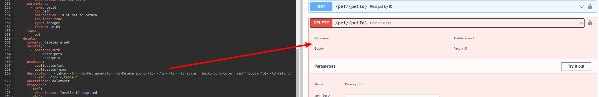

# Pet Store  JavaLite App  with OpenAPI integration

This app shows how to add the Open API documentation to the ActiveWeb APP so that a proper OpenAPI file is generated
from code and from supporting files.

##  Configuration of the plugin:

The `aw-mate` Maven plugin (stands for ActiveWeb Mate) is provided by JavaLite.

See the `pom.xml` file:

```xml
<plugin>
    <groupId>org.javalite</groupId>
    <artifactId>aw-mate</artifactId>
    ...
    <configuration>
        <templateFile>src/main/open-api/base.json</templateFile>
        <targetFile>target/classes/openapi.json</targetFile>
        <apiLocation>src/main/open-api</apiLocation>
    </configuration>
</plugin>
```

where: 
* `templateFile` - a file that will be used to inject OpenAPI paths found in code.
* `targetFile` - a file to generate. In this implementation, the file is generated and packaged into the app on the classpath.
* `apiLocation` - an alternative location of the OpenAPI docs. The Open API specs can  be placed into GET/POST/PUT.. annotations 
  directly in controllers. If that pollutes to the code, they can be placed  into this directory, as long as
  a name of a file follows the provided pattern.


## Running aw-mate plugin:

1. Ensure you run Java 16
2. Generate the OpenAPI documentation:

```
    mvn aw-mate:generate
```

Observe this in the output:

```
Output saved to: target/classes/openapi.json
```

> Note: The plugin is wired into a `COMPILE` Maven lifecycle, so it is not necessary to run it by hand.  

## Injecting HTML tables into JSON Open API 

You can embed tables into JSON with ease by using a `@table` tag. See the file [app.controllers.PetController#deletePet-delete.json](src/main/open-api/app.controllers.PetController#deletePet-delete.json). 
This file has the following: 

```
<@table file='src/main/open-api/delete-pet.html'/>
```

which is a pointer to an HTML table in a separate file. In case  you want to include HTML tables into 
your API specification, you can do that with this tag. It allows you to take advantage of the HTML and JSON editors 
separately.

The screenshot below shows how an HTML table is transformed into a UI by the [Swagger Editor](https://editor.swagger.io/):



> The AW-Mate plugin will transform the double-quotes from your HTML file into single quotes and also will 
> remove newlines and carriage returns to comply with JSON, but will not do any other processing.  


## Viewing OpenAPI live 

Perform these steps: 

```
mvn  clean install
mvn jetty:run
```

After that, access the URL: [http://localhost:8080/openapi](http://localhost:8080/openapi). 
The API is served by an `OpenapiController`:

```java
public class OpenapiController extends AppController {
    public void index(){
            respond(readResource("/openapi.json")).contentType("application/json");
    }
}
```

As you can see, this is a primitive controller that simply serves a file on a classpath. 
Such a resource can be published to the outside so that external tools consume and process it as they see fit. 


